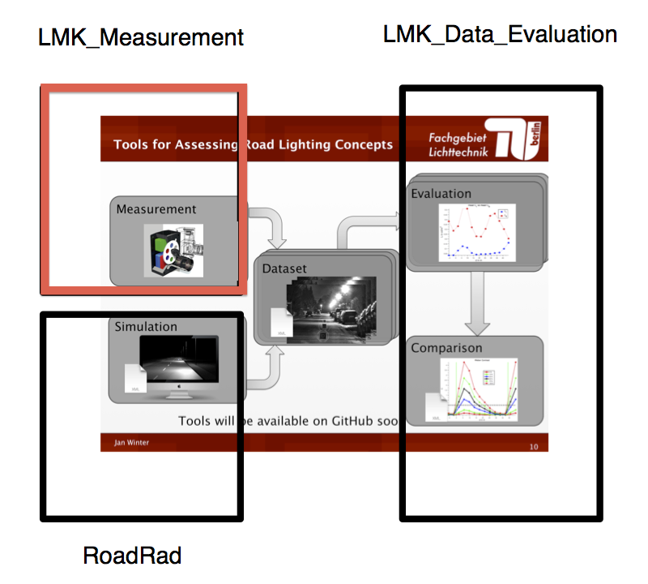
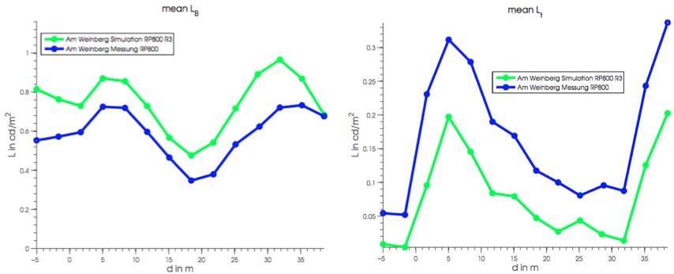

AUTHOR: Jan Winter, Sandy Buschmann, Robert Franke TU Berlin, FG Lichttechnik
CONTACT: j.winter@tu-berlin.de
LICENSE: free to use at your own risk. Kudos appreciated.

Measuring Luminance Image Series with MATLAB
=========

## Measurement / Simulation + Evaluation Framework for Road Lighting

This repository is part of a measurement / simulation framework for evaluating contrasts of a small target between two luminaires. It is possible to evaluate the small target visibility level according to ANSI IESNA RP-8-00.

This is the MATLAB based measurement part:

## Measurement

We assume that you have a TechnoTeam LMK luminance image measurement device and the corresponding LabSoft software.
With the help of this software you can easily measure luminance image series with small targets for evaluating contrasts and visibility levels.

## Evaluation

The image series can be evaluated in MATLAB with our evaluation framework [VisibilityLevel-Evaluation-MATLAB](https://github.com/fglichttechnik/VisibilityLevel-Evaluation-MATLAB):

## Further Details

For further details have a look into our help file: [Documentation/HowTo_LMK_GUI.pdf](Documentation/HowTo_LMK_GUI.pdf).

The accompanying frameworks are:
- Measurement (this framework): [TechnoTeam-LMK-MATLAB](https://github.com/fglichttechnik/TechnoTeam-LMK-MATLAB)
- Simulation: [Radiance-RoadLighting-Simulation-Framework](https://github.com/fglichttechnik/Radiance-RoadLighting-Simulation-Framework)
- Evaluation: [VisibilityLevel-Evaluation-MATLAB](https://github.com/fglichttechnik/VisibilityLevel-Evaluation-MATLAB)

